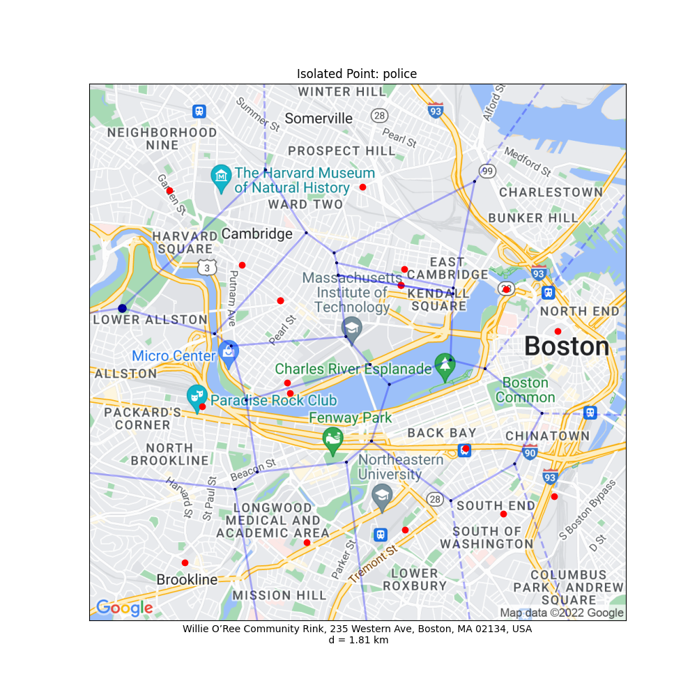
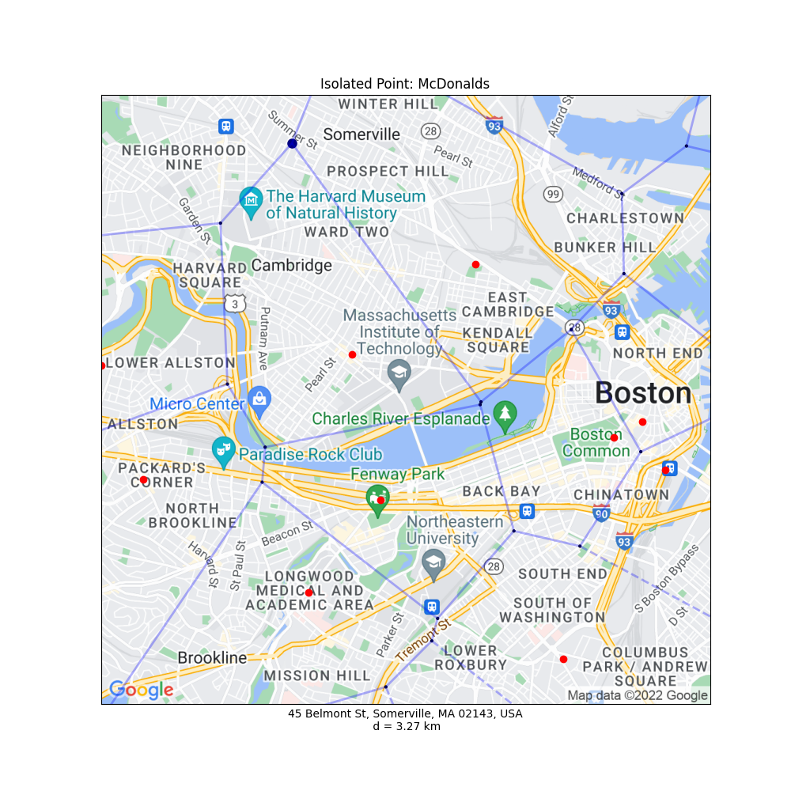

# Isolated-Points-in-Google-Maps
 Using Voronoi diagrams and Google Maps API to determine most isolated locations. Red dots represent the current existing locations. Blue dots represent isolated point candidates, and the larger blue dot is the furthest from any existing location.

